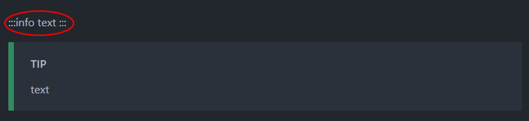
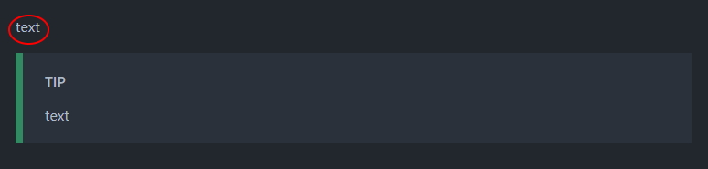
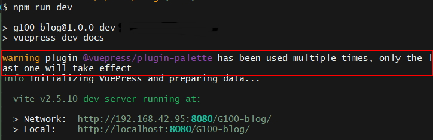

## Vuepress build-in markdown syntax

在 Vuepress 裡，Markdown 的內容是透過 [markdown-it](https://github.com/markdown-it/markdown-it) 解析的，
所以任何 markdown-it 相關 plugin 都可以使用!

而 Vuepress 本身已經有[內建一拖拉庫 syntax extensions](https://v2.vuepress.vuejs.org/zh/guide/markdown.html)。
文檔非常好讀，不再這裡贅述。

---

## 設置和 HackMD 一樣的 markdown container syntax

在寫[第一篇文章](./init.md)的時候發現，
有些語法和本身慣用的 HackMD 有一點點差異，
目前遇到的地方是 `container`

:::tip Container 就是這個有色盒子
HackMD 的種類有

- info
- warning
- success
- danger
- spoiler

Vuepress 的種類則是

- tip
- warning
- danger
- details

其中 HackMD 的 spoiler 對應到 vuepress 的 details
:::

因為本身已經習慣的 syntax，
而且未來應該會很常把 HackMD 連結到 Github 當作部落格後台來使用，
所以這次的目標是把 HackMD 有而 Vuepress 沒有的 container type 加進去。
讓之後在 HackMD 上面寫作的時候可以使用 HackMD 的 container type，
並且在 vuepress 能有相對應的解析、渲染。

預設 theme 所使用的 container plugin 是使用 [`vuepress/plugin-container@next`](https://v2.vuepress.vuejs.org/zh/reference/plugin/container.html)，由 vuepress 進行簡化過的 build-in plugin。

所以在 `.vuepress/config.js` 裡面加上設定:

```javascript{5-8}
plugins: [
  [
    '@vuepress/container',
    {
      type: 'info', //這裡的 info 是自定義的、模仿 HackMD 的 type-'info'
      before: (title: string): string =>
        // 模板純粹照抄官網現有的 sample，我懶
        // 可以額外加上自定義的 class name `something`
        `<div class="custom-container something">${title ? `<p class="custom-container-title">${title}</p>` : ''}\n`,
      after: (): string => '</div>\n'
    },
  ],
]
```

設定前:

解析時 vuepress 看不懂 :::info 所以直接輸出了
設定後:

現在 vuepress 看得懂了~ 只差 style

:::warning
如果你跟我一樣是使用 vite 開發，
有關 config 的更動並不會被 vite 偵測到，
請重開 dev server。

原因我還不知道，還沒進一步深入研究。

這問題在過去經驗也常發生，不只 vuepress 的開發，
只要是最一開始就需要的 config 程式碼，
似乎都不會被 vite 的 hot reload 偵測到，
還好 vite 重啟 server 極度快。
:::

## 把 Custom style 加進去 Default Theme

該怎麼把 css 加進去到目前的 Default Theme 呢?

請移駕到文件 - [Default Theme Reference](https://v2.vuepress.vuejs.org/reference/default-theme/styles.html)

**Default Theme 是使用 `SASS` 當作 CSS pre-processor。**

可以在 `.vuepress/styles/index.scss` 把自定義的 css 寫進去。
就能夠覆蓋樣式/增加樣式。

到這邊應該各位前端已經知道該怎麼大改特改了，
打開 devtool 就是熟悉的戰場。

:::info
我是懶人，我只先把 class 改成 vuepress 既有的 class :koala:
連 `.vuepress/styles/index.scss` 都懶得設置...
:::

### Palette

關於 theme，vuepress 是使用 [@vuepress/plugin-palette@next](https://v2.vuepress.vuejs.org/reference/plugin/palette.html)

~~剛開始我找資訊的時候完全找錯方向，
完全沒注意到上面連結的章節是放在 Theme Development，
浪費了大把青春歲月啊...~~

文件雖然說 `preset` 的預設是 `css`，
但是那應該只適用在 _開發 theme 時，指定你的 theme 規則。_

但是像 Default Theme 已經有使用 Palette 的相關設定。
如果你依循[這裡](https://v2.vuepress.vuejs.org/reference/plugin/palette.html#preset)的設定想改變預設路徑或者 `preset` 種類，

**會一點作用都沒有!**

硬硬的設定你會發現這樣的提醒:


:::danger

> Most plugins can only be used once. If the same plugin is used multiple times, only the last one will take effect.

> However, some plugins can be used multiple times (e.g. @vuepress/plugin-container), and you should check the documentation of the plugin itself for detailed guide.

palette plugin 就是只允許被使用一次的，而且你的 config 設定會在 Default Theme 設定之前。

:::
