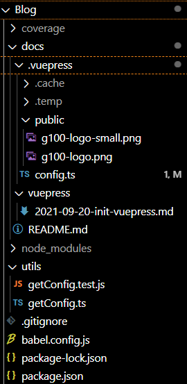
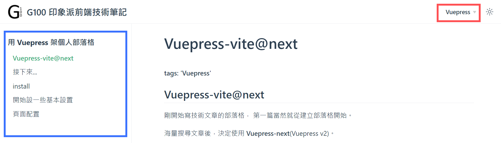
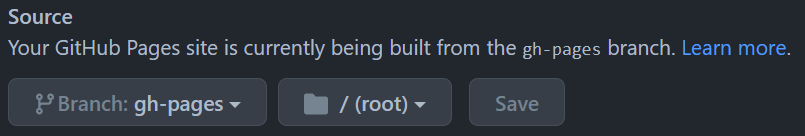
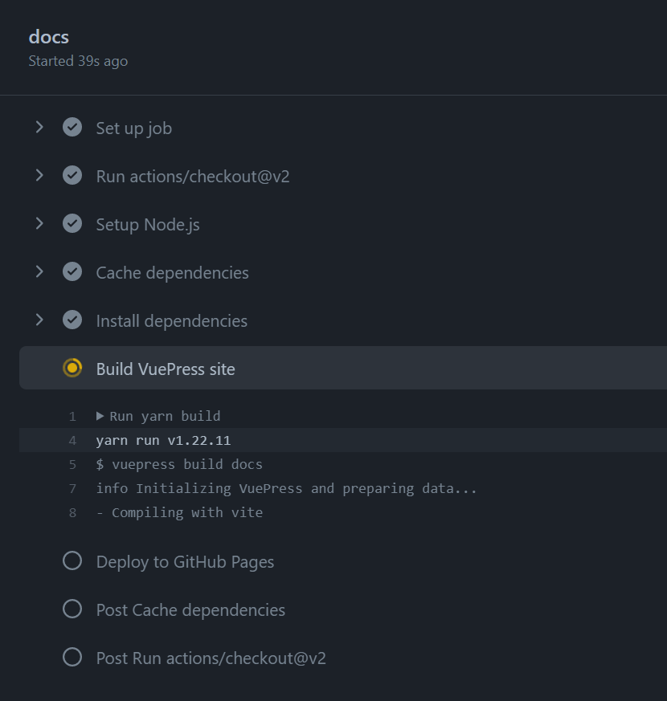

# 用 Vuepress 架個人部落格

## Vuepress-vite@next

剛開始寫技術文章的部落格，
決定第一篇當然就從建立部落格開始啦。

海量搜尋文章後，決定使用 **Vuepress-next**(Vuepress v2)。

- **支援 markdown**，
- 本質使用 **vue + vue router**，
- **markdown 解析引擎是使用 [markdown-it][1]**，這點對於用慣 HackMD 的人可能很重要?。
- 可以在 markdown 裡面使用 vue，本身學習的第一個框架就是 vue，用得最順手，考量以後如果要寫些什麼東西額外的東西當然是選支援度最好的。
- **可以使用 Vite!!**，之前 side project 時用過 vite，用一次就回不去了...
- 雖然本質上是SPA，但已經把SSR的東西幫你處理好了

其他還有考慮過 [Hexo][hexo]、[Vitepress][vitepress]

**缺點(代價):**

- Vuepress 相對冷門，教學並不多。唯一找到的是 第12屆鐵人賽 - [透過 VuePress 建構 JAMstack 網站來肆意玩弄 Markdown 系列文][ironman]，他介紹的版本應該是 v1，但還是值得看一下。
- v1 和 v2 的 plugins 和 theme 並不相容。
    v1 是使用 vue 2
    v2 是使用 vue 3
- 目前文件連結很有可能會連到 vuepress v1 的資源，請小心。

最終選擇 Vuepress 的原因:

1. 已經有很多人用 Hexo 囉...:zany_face::smirk:，反觀 Vuepress 明明有趣多了卻沒幾篇文章? 這樣對嘛!?
1. 在 vue 語法上的整合令人期待!!
1. vite 實在是太香了

#### Vitepress? Vuepress?

**注意!!**

- **Vuepress-next 已經支援 Vite!**。
- Vitepress 和 Vuepress 差在**目的、定位**不一樣。[官方文件 - Other Differences][vitepress-2]

Vitepress 感覺上會更適合用在 文檔的書寫，而 Vuepress 感覺上已經偏向可以應用在 blog 這方面的需求(因為已經有生態圈、plugins，但最初誕生的目的也是為了要讓 vue 生態系的貢獻者方便寫文件)

:::tip Murmur
我是從 [將 Hexo 的 Markdown 渲染引擎換成 markdown-it][2]，及查看 hackmdio 底下的 [codimd repo][3]，得知 HackMD 的解析引擎是 markdown-it
另外 **codimd** 是 hackMD 的開源版本，功能沒有書本模式。
:::

:::tip
Vuepress 的介紹除了官方也可以參考 [BILLY CHIN - 介紹 VuePress 官方部落格主題與套件][4]
:::

[1]:https://github.com/markdown-it/markdown-it
[2]:https://titangene.github.io/article/hexo-markdown-it.html
[3]:https://github.com/hackmdio/codimd
[4]:https://billyyyyy3320.com/zh/2020/01/25/intro-to-vuepress-blog-theme-and-plugin/
[hexo]:https://hexo.io/zh-tw/
[vitepress]:https://vitepress.vuejs.org/
[vitepress-2]:https://vitepress.vuejs.org/#other-differences
[ironman]:https://ithelp.ithome.com.tw/users/20129182/ironman/3444

## 接下來

跳著看官網文件吧!
以下是我實作時看官網的順序:

1. install、建立空白網站 (Getting started)
1. head 設置 (自行看官網 [Configuration - Config File][head])
1. 頁面配置 ([Theme][Theme])
1. deployment

:::danger
**我並不會完整地把每一步每一步流程詳細列出來，**
請先大致上閱讀過**官方文件**。
**一步一步列出來、那就叫 寫實派 了**
:::

[head]:https://v2.vuepress.vuejs.org/guide/configuration.html#config-file
[Theme]:https://v2.vuepress.vuejs.org/guide/theme.html#community-theme

## install

可以在最一開始的時候就先選擇你的 bundler 要使用 webpack 還是 vite

```
npm install -D vuepress@next
// or
npm install -D vuepress-vite@next
```

照著官網 Getting started 做就可以立馬使用 `npm run dev` 在 local 建立一個 空蕩蕩 的靜態網站。

## 開始設一些基本設置

Vuepress 檔案幾乎都放在 `docs` 這個資料夾底下，
docs 底下可以建立 `.vuepress` 資料夾，`.vuepress`專門放 vuepress 指定的 config file，
而文章(`.md`)則放在 `docs`。

```
├─ docs
│  ├─ .vuepress
│  │  └─ config.js
│  │
│  ├─ posts
│  │  └─ something.md (path: '/posts/something.html')
│  │
│  ├─ aboutme.md (path: '/aboutme.html')
│  └─ README.md (README是首頁 root path: `/`)
├─ .gitignore
└─ package.json
```

預設情況 route 是根據 `docs` 檔案目錄配置產生的。
把 `docs` 當作 **`sourceDir`**。
文件確實是使用 **`sourceDir`** 來稱呼的，大概是要跟專案內的 root path 做個區隔。可以簡單理解成 root path 即可。

**還沒有設置 nav**，
當你依照上面的規則新增檔案後，
手動的在瀏覽器網址 key 入相對應的網誌就會看到新增的內容了。

## 頁面配置

ㄜ...順順的看 Guide 可能會一頭霧水:confused:，我弄出一個空白頁面後要怎麼開始建立其他細節啊!?

在 Vuepress 的世界裡，可以把`theme`理解成是額外的 plugins，你可以寫你自己的也可以用別人已經開發好的，但是**每個 theme 可能都有不一樣的 config**。
如果你已經有中意的 theme 建議可以直接安裝、照著那個 theme 的文件是配製你的頁面。

如果覺得 default theme 已經滿足你的需求
請見 [Default Theme Config][defaultTheme]
相關設置包含 nav, sidebar, search box 都在裡面。

- 要找貢獻者們的樣式請到 npm、`keywords:vuepress-theme`找，目前似乎還沒有一個地方去整合蒐集這些 theme。
- **自己寫的話...就是用 Vue 來寫!!**

所以...我決定就先用預設的吧，之後再來自己寫樣式
> murmur: 其實是因為找不到喜歡的 theme 可以直接套用:zany_face: 目前樣式還非常非常少

[defaultTheme]:https://v2.vuepress.vuejs.org/reference/default-theme/config.html#home

:::warning
看文件的時候請注意版本!! Default Theme 許多名稱是不一樣的，另外 config 是能夠使用 typescript 的。
:::

### Navbar

第一步先把 [Navbar][Navbar] 弄出來吧~~
(請搭配文檔服用)

其實在剛剛建好的空白網站已經透過內部機制有 navbar 的功能了，只是因為預設值是 `[]`，所以沒有東西。
必須設置 `navbar` property 在 theheConfig 裡面。

我的部落格預計會是以**大項目去做 nav，例如 'OOO' 相關的文章就是一個 nav item，vue-router 則會是一個 nav item 的 child item，檔案預計會以資料夾做區分**。

每新增一個 nav item 就要來 config 這裡設置，這種事情我才不幹勒。
所以，只要能把目錄路徑變成符合 themeConfig 所需要的 array 就可以了吧? 大概是用 node.js 完成。

應該寫一個簡單的 function 就可以滿足我的需求了吧~?
但這功能其實我不會做也沒做過，所以我 google 了以下關鍵字--`vuepress auto navbar`
:::tip
**用關鍵字找資源**這件事情對工程師來說超級無敵重要!
我們是人不是神，絕對不可能什麼都可以在短時間內把什麼都學會還融會貫通，拜託...光各種文件就看不完了，還融會貫通!
**適時利用四方各界善心人士所分享的心得文章，可能比你能在四個小時內看完整份技術文件的能力還來的重要。**
如果可以的話看完別人的文章也點個愛心之類的，沒錢贊助至少支持一下。

偏偏怎麼下關鍵字這種事情我真的不知道該如何形容...
在幫忙帶 好想工作室-web camp 新學員的時候常常會遇到新生不知道怎麼從茫茫大海中下關鍵字找到自己需要的資源，
所以在接下來的文章遇到我是在網路上找資源時，我會附上我當時所蒐尋的關鍵字給，**僅做參考**。
:::

找到以下資源:

- Blog:
  - [Automatic Dynamic Sidebars in Vuepress][navbar1]
- Stackoverflow:
  - [How to make vuepress dynamically create the side navigation?][navbar2]
- Issue:
  - [Option to automatically list sub-directory in the sidebar][navbar3]

如果你懶得看文章，這裡是我快速掃描後的結論:

- 已經有 plugin 可以使用，但幾乎都是 vuepress v1
- 如果要自己做，至少會用到 nodejs 的 `fs`, `path`。

最後~~抄~~參考了 [Prashanth Krishnamurthy][navbar1] 這位仁兄的做法。

[Navbar]:https://v2.vuepress.vuejs.org/reference/default-theme/config.html#navbar

[navbar1]:https://techformist.com/automatic-dynamic-sidebar-vuepress/
[navbar2]:https://stackoverflow.com/questions/66531421/how-to-make-vuepress-dynamically-create-the-side-navigation
[navbar3]:https://github.com/vuejs/vuepress/issues/613

到目前為止我的檔案目錄結構長這樣:



config:

```javascript
import { defineUserConfig } from 'vuepress-vite';
import type { DefaultThemeOptions } from 'vuepress-vite';
import { getNavConfig } from '../../utils/getConfig';

export default defineUserConfig<DefaultThemeOptions>({
  lang: 'zh-TW',
  title: 'G100 印象派前端技術筆記',
  description: 'Just playing around',
  head: [['link', { rel: 'icon', href: '/g100-logo-small.png' }]],

  themeConfig: {
    logo: '/g100-logo.png',
    navbar: [
      ...getNavConfig('Vuepress', 'vuepress')
    ]
  },
});
```

getCofig util:

```javascript
import fs from 'fs';
import path from 'path';
// 其實並沒有任何文件教你指定 import NavbarConfig 近來單獨使用
// 我只是因為懶得另外定義...
// 而且這樣也能讓 vscode 直接告訴你裡面還有什麼其他你可以使用的東西，
// 例如目前沒有用到的 link, activeMatch, rel, target
import { NavbarConfig } from '@vuepress/theme-default/lib/shared/nav';

/**
 * screen child file name which under the specified folder. Only return extension name is '.md'
 * @param text nav item title
 * @param folderName specified folder name
 * @returns \{ title, children: [...fileName] }[]
 */
export function getNavConfig(text: string, folderName: string): NavbarConfig {
  const extension = ".md";

  const files: string[] = fs
    .readdirSync(path.join(getTargetDirecory(folderName)))
    .filter(
      (fileName: string) => {
        if (fileName.toLowerCase() === "readme.md") return false;

        return fs.statSync(path.join(getTargetDirecory(folderName), fileName)).isFile() &&
          (path.extname(fileName)) === extension;
      }
    )
    .map((fileName: string) => `/${folderName}/${fileName}`);
  return [{ text, children: [...files] }];
}

function getTargetDirecory(folder: string): string {
  return `${__dirname}/../docs/${folder}`;
}
```

view:


### Sidebar

嘖嘖，左邊的 sidebar 呈現我不想要這樣!
預設是把 `.md` 中的各個 `header` 作為 child nav，
前面提到 Vuepress 本來就是為了文件而生的，
這樣的呈現方式在文件確實合情合理也比較好讓技術人員找到想要的內容，但是我想我以後寫出來的文章，副標題應該是不會有什麼參考價值XD，也不會一篇文章樂樂長。

我想要的 sidebar 是 **進入到 'OOO'分類，就顯示 'OOO' 底下的這個文章，不管我點擊到哪一篇文章，sidebar 都不會變；但是當我進入到 'XXX'分類，sidebar 就換成 'XXX' 底下的文章**

這個需求只要用 [文件][sb1] example2 並且把 `sidebarDepth` 設為 `1` 就可以解決，
但是一樣，我不想要在 `config` 裡一個一個指定 `children` 的 fileName。

```javascript
export function getSidebarConfig(text: string, subPathName: string): SidebarConfigObject {
  return { [`/${subPathName}/`]: getNavConfig(text, subPathName) };
}
```

因為格式長得差不多...我只簡單寫了這樣(懶)...呵呵

```javascript
// config.js
{
    ...something,
    
    sidebar: {
      ...getSidebarConfig('Vuepress', 'vuepress'),
    },
}
```

[sb1]:https://v2.vuepress.vuejs.org/reference/default-theme/config.html#sidebar

### Deployment

設置到這裡剩下的就只是把文件看一看，把頁面填一填，
簡易 blog 就快完成了!!

Deployment 的部分直接看[文件](https://v2.vuepress.vuejs.org/guide/deployment.html#github-pages)XD

1. 設好 config 的 `base` 參數。絕大多數人應該都是專案獨立的github page -- `https://gitlab.com/<USERNAME>/<REPO>`，所以 `base` 設成 `/<REPO名稱>/` 即可。
1. 如果你跟我一樣使用 github page，在專案根目錄底下建立 .github/workflows 資料夾，下面這段複製貼上。
1. 注意下面 L44，我在新增專案的時候 package.json 的 `scripts` 並沒有完全按照官網 Getting Started - Manual Installation 的指令，而是寫慣用的 'dev' 和 'build'，所以你如果也有改，請記得也把 L44 改成與你的 package.json 相符的 `scripts`

::: details

```yaml
name: docs

on:
  # trigger deployment on every push to main branch
  push:
    branches: [main]
  # trigger deployment manually
  workflow_dispatch:

jobs:
  docs:
    runs-on: ubuntu-latest

    steps:
      - uses: actions/checkout@v2
        with:
          # fetch all commits to get last updated time or other git log info
          fetch-depth: 0

      - name: Setup Node.js
        uses: actions/setup-node@v1
        with:
          # choose node.js version to use
          node-version: '14'

      # cache node_modules
      - name: Cache dependencies
        uses: actions/cache@v2
        id: yarn-cache
        with:
          path: |
            **/node_modules
          key: ${{ runner.os }}-yarn-${{ hashFiles('**/yarn.lock') }}
          restore-keys: |
            ${{ runner.os }}-yarn-

      # install dependencies if the cache did not hit
      - name: Install dependencies
        if: steps.yarn-cache.outputs.cache-hit != 'true'
        run: yarn --frozen-lockfile

      # run build script
      - name: Build VuePress site
        run: yarn docs:build

      # please check out the docs of the workflow for more details
      # @see https://github.com/crazy-max/ghaction-github-pages
      - name: Deploy to GitHub Pages
        uses: crazy-max/ghaction-github-pages@v2
        with:
          # deploy to gh-pages branch
          target_branch: gh-pages
          # deploy the default output dir of VuePress
          build_dir: docs/.vuepress/dist
        env:
          # @see https://docs.github.com/en/actions/reference/authentication-in-a-workflow#about-the-github_token-secret
          GITHUB_TOKEN: ${{ secrets.GITHUB_TOKEN }}
```

:::

接著去 github 設置你的 github page 就完成了~

[github](https://github.com/) > 你的部落格repo > Setting > Pages > Source 改成 gh-pages



每當你 `git push` 就會啟動 github action，你的部落格就會重 build，就可以在 github page 直接看到新的內容。
可以在 `Actions` 分頁查看部屬的狀況


